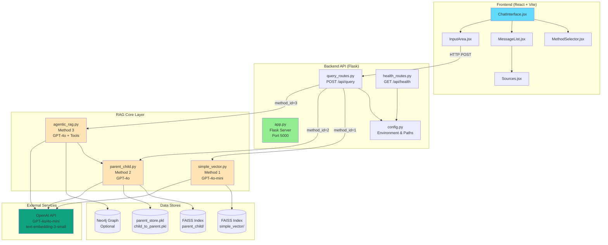
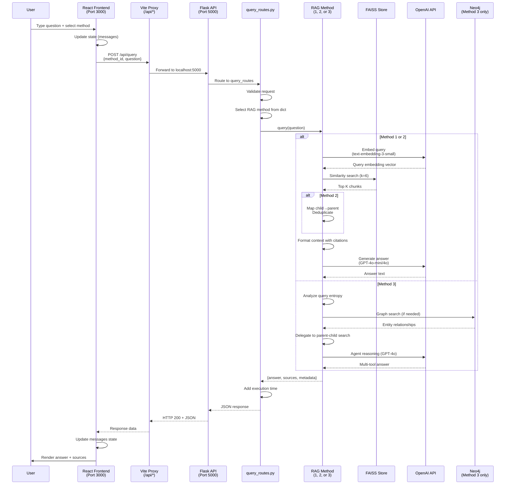
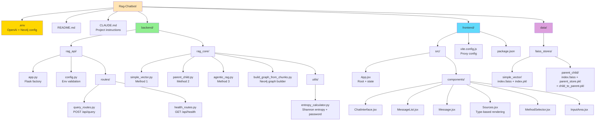
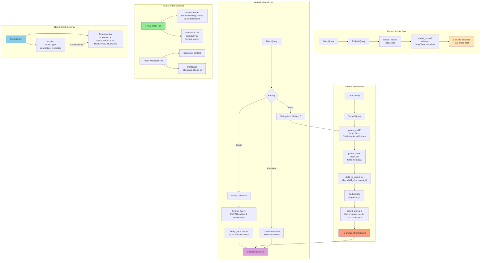

# RAG Chatbot System Diagrams

This document contains comprehensive architectural diagrams for the RAG Chatbot system.

## Table of Contents
1. [System Architecture](#1-system-architecture)
2. [RAG Methods Comparison](#2-rag-methods-comparison)
3. [Request/Response Data Flow](#3-requestresponse-data-flow)
4. [Method 3: Agentic RAG Architecture](#4-method-3-agentic-rag-architecture)
5. [Directory Structure](#5-directory-structure)
6. [Component Interaction](#6-component-interaction)
7. [Data Layer Architecture](#7-data-layer-architecture)

---

## 1. System Architecture

High-level overview of the entire system showing frontend, backend, and data layers.



---

## 2. RAG Methods Comparison

Detailed flowchart showing how each RAG method processes queries differently.

```mermaid
graph TB
    START[User Question]

    START --> METHOD_SELECT{Selected Method?}

    METHOD_SELECT -->|Method 1| M1_START[Simple Vector RAG]
    METHOD_SELECT -->|Method 2| M2_START[Parent-Child RAG]
    METHOD_SELECT -->|Method 3| M3_START[Agentic RAG]

    subgraph "Method 1: Simple Vector RAG"
        M1_START --> M1_EMBED[Embed query<br/>text-embedding-3-small]
        M1_EMBED --> M1_FAISS[FAISS similarity search<br/>with MMR<br/>k=6 chunks]
        M1_FAISS --> M1_CONTEXT[Format context:<br/>[DocumentName - p.X]<br/>concatenate chunks]
        M1_CONTEXT --> M1_LLM[GPT-4o-mini<br/>temp=0.2<br/>+ System Prompt]
        M1_LLM --> M1_ANSWER[Answer with<br/>inline citations]
        M1_ANSWER --> M1_SOURCES[Sources:<br/>type: chunk]
    end

    subgraph "Method 2: Parent-Child RAG"
        M2_START --> M2_EMBED[Embed query<br/>text-embedding-3-small]
        M2_EMBED --> M2_FAISS[FAISS search on<br/>CHILD chunks<br/>400 chars, k=6]
        M2_FAISS --> M2_MAP[Map child IDs to<br/>parent IDs<br/>child_to_parent.pkl]
        M2_MAP --> M2_DEDUP[Deduplicate by<br/>parent_id]
        M2_DEDUP --> M2_PARENT[Retrieve PARENT chunks<br/>2000 chars<br/>parent_store.pkl]
        M2_PARENT --> M2_CONTEXT[Format context with<br/>full parent content]
        M2_CONTEXT --> M2_LLM[GPT-4o<br/>temp=0.2<br/>+ System Prompt]
        M2_LLM --> M2_ANSWER[Text-first answer<br/>code only if requested]
        M2_ANSWER --> M2_SOURCES[Sources:<br/>type: parent_chunk]
    end

    subgraph "Method 3: Agentic RAG (Simplified)"
        M3_START --> M3_ANALYZE[Analyze query<br/>Entropy Calculator]
        M3_ANALYZE --> M3_ROUTE{Query Type?}

        M3_ROUTE -->|Password| M3_PWD[Password Strength<br/>Analyzer Tool]
        M3_ROUTE -->|Complex| M3_GRAPH[Graph Search Tool<br/>Neo4j]
        M3_ROUTE -->|Default| M3_PC[Parent-Child<br/>Search Tool]

        M3_PWD --> M3_COMBINE[Combine results]
        M3_GRAPH --> M3_COMBINE
        M3_PC --> M3_COMBINE

        M3_COMBINE --> M3_LLM[GPT-4o<br/>Agent Reasoning]
        M3_LLM --> M3_ANSWER[Multi-source answer]
        M3_ANSWER --> M3_SOURCES[Sources:<br/>graph/entropy_analysis/<br/>parent_chunk]
    end

    M1_SOURCES --> END[Response to Frontend]
    M2_SOURCES --> END
    M3_SOURCES --> END

    style M1_START fill:#FFE4B5
    style M2_START fill:#FFA07A
    style M3_START fill:#DDA0DD
    style END fill:#90EE90
```

---

## 3. Request/Response Data Flow

Sequence diagram showing the complete journey of a query through the system.



---

## 4. Method 3: Agentic RAG Architecture

Detailed view of Method 3's tool-based agent system (current simplified implementation).

```mermaid
graph TB
    START[Incoming Query]

    START --> ENTRY[agentic_rag.py<br/>query method]

    subgraph "Current Implementation (Simplified)"
        ENTRY --> SIMPLE{Simplified<br/>Mode?}
        SIMPLE -->|Yes<br/>Current| DELEGATE[Delegate directly to<br/>parent_child_search]
        DELEGATE --> PC_SEARCH[ParentChildRAG.query]
        PC_SEARCH --> FORMAT[Format as tool result]
        FORMAT --> RETURN[Return response]
    end

    subgraph "Full Agent Implementation (Partial)"
        SIMPLE -->|No<br/>Not Active| ENTROPY[Query Entropy<br/>Analyzer Tool]

        ENTROPY --> COMPLEXITY{Query<br/>Complexity?}

        COMPLEXITY -->|High Entropy<br/>+ Keywords| TOOLS[Available Tools]

        TOOLS --> T1[graph_search<br/>Neo4j relationships]
        TOOLS --> T2[parent_child_search<br/>Documentation search]
        TOOLS --> T3[query_entropy_analyzer<br/>Shannon entropy]
        TOOLS --> T4[password_strength_analyzer<br/>Security analysis]

        T1 --> AGENT[LangChain Agent<br/>GPT-4o]
        T2 --> AGENT
        T3 --> AGENT
        T4 --> AGENT

        AGENT --> REASON[Agent selects tool<br/>based on query]
        REASON --> EXECUTE[Execute tool call]
        EXECUTE --> MULTI{Multiple<br/>tools needed?}
        MULTI -->|Yes| REASON
        MULTI -->|No| SYNTHESIZE[Synthesize final answer]

        SYNTHESIZE --> FINAL[Return multi-source response]
    end

    subgraph "Tool Details"
        direction TB
        GT[graph_search Tool]
        GT --> GT1[Extract keywords from query]
        GT --> GT2[Search Neo4j for entities]
        GT --> GT3[Return relationships<br/>limit 15]

        PCT[parent_child_search Tool]
        PCT --> PCT1[Delegate to Method 2]
        PCT --> PCT2[Return chunks + metadata]

        ET[entropy_analyzer Tool]
        ET --> ET1[Calculate Shannon entropy]
        ET --> ET2[Normalize to 0-1]
        ET --> ET3[Recommend tools<br/>O(n) complexity]

        PT[password_analyzer Tool]
        PT --> PT1[Calculate entropy in bits]
        PT --> PT2[Character diversity score]
        PT --> PT3[Strength rating + tips]
    end

    style SIMPLE fill:#FFD700
    style DELEGATE fill:#90EE90
    style AGENT fill:#DDA0DD
    style RETURN fill:#90EE90
```

---

## 5. Directory Structure

Visual representation of the codebase organization.



---

## 6. Component Interaction

How frontend components interact with each other and backend.

```mermaid
graph TB
    subgraph "Frontend Component Hierarchy"
        APP[App.jsx<br/>State Management]

        APP --> CHAT[ChatInterface.jsx<br/>Layout Container]

        CHAT --> METHOD[MethodSelector.jsx<br/>Buttons: 1, 2, 3]
        CHAT --> MSGLIST[MessageList.jsx<br/>Message Container]
        CHAT --> INPUT[InputArea.jsx<br/>Question Input]

        MSGLIST --> MSG[Message.jsx<br/>Single Message]
        MSG --> SRC[Sources.jsx<br/>Source Rendering]
    end

    subgraph "State Flow"
        STATE[App State]
        STATE --> MESSAGES[messages: Array<br/>role, content, sources]
        STATE --> SELECTED[selectedMethod: 1|2|3]
        STATE --> LOADING[loading: boolean]

        METHOD -->|setSelectedMethod| SELECTED
        INPUT -->|handleSubmit| APICALL[Fetch /api/query]
        APICALL -->|Update| MESSAGES
        APICALL -->|Toggle| LOADING
    end

    subgraph "Source Type Rendering"
        SRC --> TYPE{source.type}

        TYPE -->|chunk| CHUNK[Simple content box<br/>Method 1]
        TYPE -->|parent_chunk| PARENT[Parent metadata<br/>Method 2]
        TYPE -->|graph| GRAPH[Relationship format<br/>Neo4j edges]
        TYPE -->|entropy_analysis| ENTROP[Structured entropy<br/>display]
        TYPE -->|password_analysis| PWD[Password strength<br/>card with tips]
    end

    subgraph "API Communication"
        APICALL --> REQ[Request:<br/>{method_id, question}]
        REQ --> BACKEND[Backend /api/query]
        BACKEND --> RESP[Response:<br/>{answer, sources, metadata}]
        RESP --> MESSAGES
    end

    style APP fill:#61dafb
    style STATE fill:#FFE4B5
    style BACKEND fill:#90EE90
```

---

## 7. Data Layer Architecture

How data is stored and accessed by different RAG methods.



---

## Understanding the Diagrams

### Color Coding
- **Light Blue (#61dafb)**: Frontend React components
- **Light Green (#90EE90)**: Backend API layer
- **Peach (#FFE4B5)**: RAG Method 1 (Simple Vector)
- **Coral (#FFA07A)**: RAG Method 2 (Parent-Child)
- **Plum (#DDA0DD)**: RAG Method 3 (Agentic)
- **Gold (#FFD700)**: Configuration/Critical files
- **Green (#10a37f)**: External services (OpenAI)
- **Sky Blue (#87CEEB)**: Neo4j database

### Diagram Usage Tips

1. **System Architecture**: Start here to understand the big picture
2. **RAG Methods Comparison**: See how each method differs in approach
3. **Data Flow**: Follow a request from user input to response
4. **Method 3 Architecture**: Understand the agent's tool selection logic
5. **Directory Structure**: Navigate the codebase organization
6. **Component Interaction**: Understand React state management
7. **Data Layer**: See how FAISS and Neo4j store and retrieve information

### Key Insights

- **Method 1** is fastest (simple vector search + GPT-4o-mini)
- **Method 2** provides better context (parent chunks after child retrieval)
- **Method 3** is most sophisticated (multi-tool agent, currently simplified)
- **Data isolation**: Each method has its own FAISS store structure
- **Lazy Neo4j**: Only connects when graph_search tool is called
- **Singleton pattern**: RAG instances initialize once at module load

---

## Maintenance Notes

These diagrams were generated using Mermaid syntax and can be:
- Rendered in GitHub markdown
- Viewed in VS Code with Mermaid extensions
- Exported to PNG/SVG using Mermaid CLI
- Embedded in documentation sites (GitBook, Docusaurus, etc.)

To update diagrams, edit the Mermaid code blocks in this file directly.
